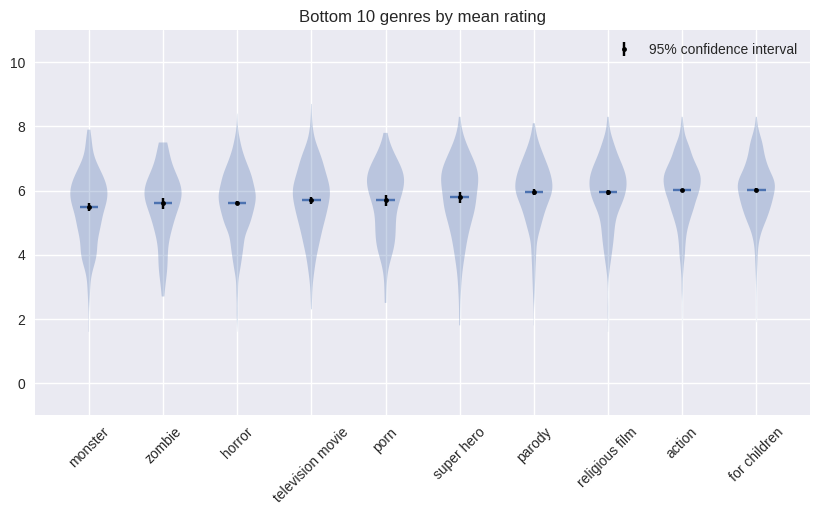

# The Big Flop

The conducted analysis can be found on the notebook: `src/initial_analysis.ipynb` and the data story from `antonpirhonen.github.io/ada-data-story`

## Abstract

In this project, we analyze low-rated movies and see what are their typical characteristics.
We obtain the movie data from two main sources: the CMU Movie Summary Corpus and the IMDB dataset.
During the project, we investigate how the factors, such as competition, movie topic and genre, contribute to a movie's rating.
By conducting this investigation, we hope to provide guidance on how to avoid producing a movie that is likely to receive bad reviews.

## Research questions

The research questions we want to answer with our analysis are:
1. Are there common characteristics between the failing movies?
2. Why does a movie fail and is it possible to predict which movie fails?

## Proposed additional datasets

In addition to the provided CMU Movie Summary Corpus, we use the following additional datasets:

### [IMDb dataset](https://www.kaggle.com/datasets/rounakbanik/the-movies-dataset)

This dataset is similar to our original dataset, but provides additional information about the movies, such as the user ratings, budget, production companies, keywords etc. To merge this dataset with the original one, we scraped the IMDb ids related to the movies in our original dataset thus connecting the two datasets.

## Methods

### Researching common characteristics between the failing movies

For the purposes of this analysis, we defined a low rated movie as a movie having an user rating less than 5.5/10.
We study if they are similar in terms of genre, budget, revenue, competition and keywords.
We use both regression and classification methods to answer the research questions.
Regression methods are used to predict the user rating of a movie based on the features we are interested in, whereas classification methods are used to predict whether a movie is a failure or not.

### Outlook on the features

**Genre**
In terms of genre, we analyzed which genres had the lowest rating. The following violin plot shows the worst rated genres. We used genre as a one-hot encoded variable for the regression analysis.

  

**Competition**
To analyse the effect of competition on being a low rated movie, we studied the causal effect of the number of movies released each week, month or year optionally grouped by genres. We trained a linear model to predict if a movie is a failure based on those features and in addition to features like budget, vote_average, popularity. 

**Keywords**
Keywords are a good indicator of the movie topic. We cluster the keywords into topics by considering the list of keywords for each movie as a text document, and then use Latent Dirichlet Allocation (LDA) for topic modelling. Then, we use the most probable topic of a movie to predict its rating.

## Results
 - Rejected the hypothesis that 

### Why does a movie fail and is it possible to avoid producing a failing movie?
After finding the common characteristics of the failing movies, we will try to find out causal effects behind movie failure. We can attempt to measure the causal relationship by conducting an observational study similar to what we did during week 6 of the course. The process of finding causal features might be difficult considering our features and their limited ability to describe a movie failure. This will be done for the next delivery.

## Proposed timeline
| Date   |      Milestone      |
|----------|:-------------:|
|18.11|Project 2 submission|
|25.11|Find the common characteristics in failing movies in terms of actors, budget and plot sentiments (Question 2)   Analyze movie failures by time periods  (Question 2)|
|2.12|Improve the project 2 analysis based on feedback   Homework 2 Submission|
|9.12|Find causal effects behind movie failure (Question 3) Start working on the Data story|
|16.12|Finish analysis Write the data story|
|23.12|Finish the data story Final project submission|

## Team organization
| Member   |      Tasks      |
|----------|:-------------:|
| Everybody | Writing the data story |
| Ana | Analyze if the actors' and budgets' effects   Hosting the data story website |
| Anton | Conduct the observational study | 
| Hédi | Failures by different time period |
| Son | Trope analysis   Sentiment analysis   Observational study|

## Reference