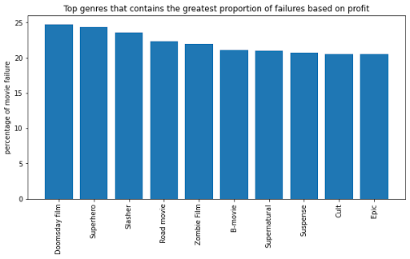
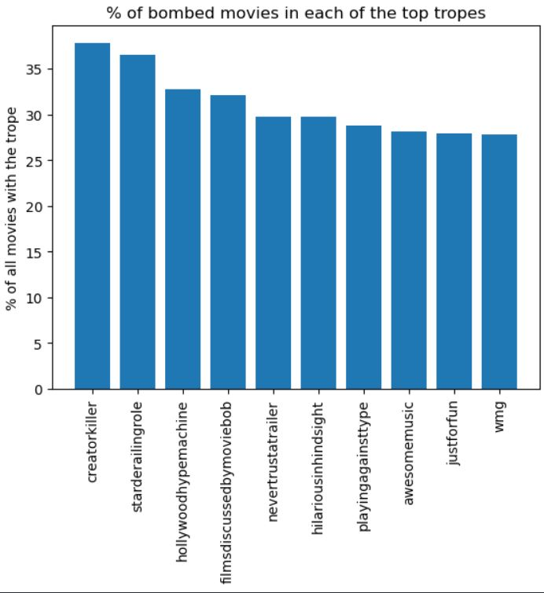

# The Big Flop

## Abstract

Producing a flop movie can be a disaster for a studio. Unsuccessful productions, like Cleopatra (1963), have brought film production companies to the verge of bankruptcy. In this project, our goal is to find the typical characteristics of failing movies.

In order to do so, we need to define what constitutes a failing movie. We quantify the failure of a movie by two metrics: the profit and the general public's opinion. We obtain these metrics from multiple datasets, such as the CMU Movie Summary Corpus, the IMDB dataset, and the TV Tropes Wiki.

With this quantification of failure, we are trying to understand what factors, such as competition, character tropes or genre, contribute to a movie's likelihood of failing. By conducting this investigation, we hope to provide guidance on how to avoid producing a movie that is likely to fail.

## Research questions

The research questions we want to answer with our analysis are:
1. What movies can be considered as failures?
2. Are there common characteristics between the failing movies?
3. Why does a movie fail and is it possible to avoid producing a failing movie?

## Proposed additional datasets

In addition to the provided CMU Movie Summary Corpus, we use the following additional datasets:

### [IMDb dataset](https://www.kaggle.com/datasets/rounakbanik/the-movies-dataset)

This dataset is similar to our original dataset, but provides additional information about the user ratings, budget. production companies, etc. To merge this dataset with the original one, we scraped the IMDb ids related to the movies in our original dataset thus connecting the two datasets.

### [TV Tropes Wiki](https://tvtropes.org/pmwiki/pmwiki.php/Main/HomePage)

This webpage contains information about the tropes that appear in movies. We obtained [a dataset](https://paperswithcode.com/dataset/movies-and-tropes-march-2020) containing movies with the trope information and joined the tropes with our original dataset by using the movie titles. For simplicity in the merging process, we discarded all movies with duplicated titles. Within the tropes provided in the dataset, there is the trope “BoxOfficeBomb” which we can use as an indicator for movies that failed.

## Methods

### What movies can be considered as failures?

To filter the subset of failing movies from the dataset, we used three criteria:
- The movie's profit is negative in the IMDb data.
- The movie's rating is in the lowest quartile.
- The movie is classified as a 'Box Office Bomb' in the TV Tropes Wiki.

A movie's profit is calculated as the difference between the movie's budget and the movie's revenue. The profits are adjusted for inflation with U.S.
Consumer Price index using the [cpi python library](https://palewi.re/docs/cpi/). This adjustment is necessary to allow us to compare the magnitude of failure between movies produced in different years.

Using the profit calculated from the IMDb data is not necessarily a precise quantification of the movie's failure [1]. We still assume that it can provide valuable information when deciding whether a movie is a failure.

We decided to use the lowest quartile of the ratings as a threshold for failure. We believe that being in the lowest quartile of the ratings is a sufficient indicator of a movie's failure.

### Are there common characteristics between the failing movies?

After retrieving the failing movies, we will study if they are similar in terms of genre, trope analysis and competition. In the future, we could also consider analyzing failing movies in different time periods and the effects of the actors, the budget and the plot sentiments.

**Genre**

In terms of genre, we wanted to find out which genres had the highest relative frequency of failing movies. The following barplot shows the genres with the highest failure rate.

  

**Trope analysis**

In the trope analysis, we want to understand whether a movie contains tropes that might explain why that movie failed. We use the presence or absence of a trope to predict whether the movie contains the trope “BoxOfficeBomb” using logistic regression. We choose the indicators of the presence of the 100 most common tropes in the dataset as the features. Next, we consider the strength and p-values of these features, and end up with some tropes that might explain why a movie failed.

  

In more advanced analysis of tropes, we plan to analyze movies with the same tropes, especially the ones that are highly predictive of the “BoxOfficeBomb” label, but different in the label and explain this difference.

**Competition**
To analyse the effect of competition on being a failing movie, we will study the causal effect of the number of movies released each week, month or year grouped by genres or countries. As an initial analysis we trained a linear model to predict if a movie is a failure based on those features and additional features like budget, vote_average, popularity. 

The results of this model are slightly different whether we were predicting failures based on reviews or profit. In both cases the number of movies released the same year has a negative effect on the movie's success. In more advanced analysis, we will see if there are more complex relations between the features extracted and movie failures. 

### Why does a movie fail and is it possible to avoid producing a failing movie?
After finding the common characteristics of the failing movies, we will try to find out causal effects behind movie failure. We can attempt to measure the causal relationship by conducting an observational study similar to what we did during week 6 of the course. The process of finding causal features might be difficult considering our features and their limited ability to describe a movie failure. This will be done for the next delivery.

## Proposed timeline
| Date   |      Milestone      |
|----------|:-------------:|
|18.11|Project 2 submission|
|25.11|Find the common characteristics in failing movies in terms of actors, budget and plot sentiments (Question 2)   Analyze movie failures by time periods  (Question 2)|
|2.12|Improve the project 2 analysis based on feedback   Homework 2 Submission|
|9.12|Find causal effects behind movie failure (Question 3) Start working on the Data story|
|16.12|Finish analysis Write the data story|
|23.12|Finish the data story Final project submission|

## Team organization
| Member   |      Tasks      |
|----------|:-------------:|
| Everybody | Writing the data story |
| Ana | Analyze if the actors' and budgets' effects   Hosting the data story website |
| Anton | Conduct the observational study | 
| Hédi | Failures by different time period |
| Son | Trope analysis   Sentiment analysis   Observational study|
